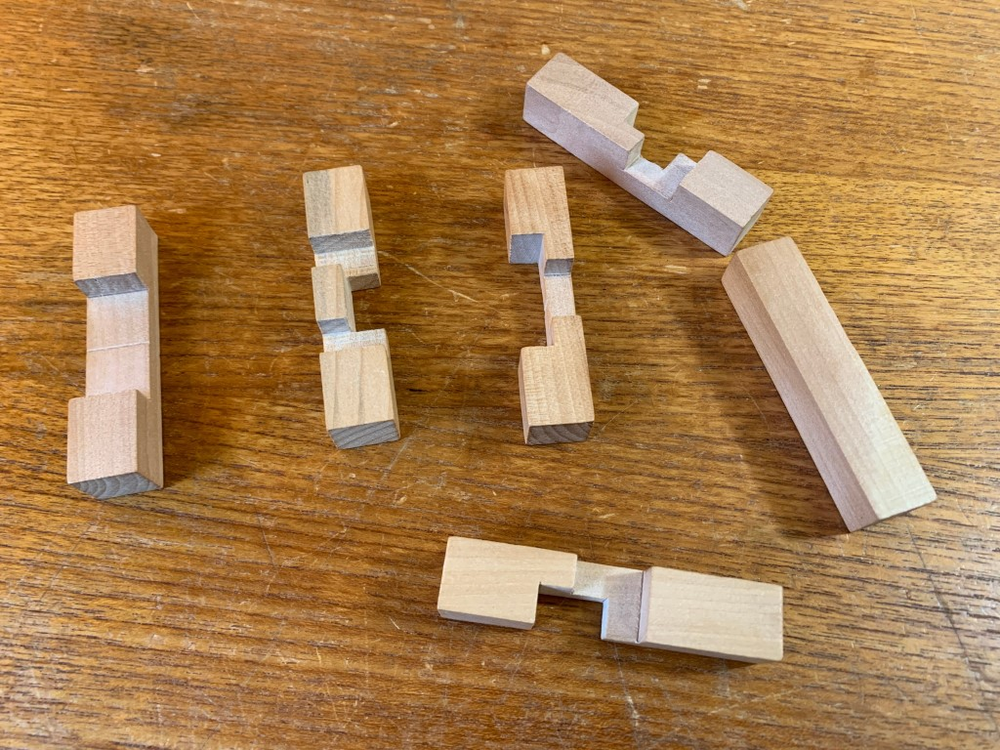
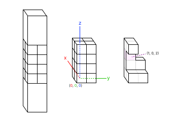
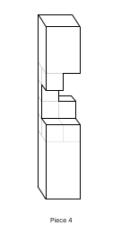
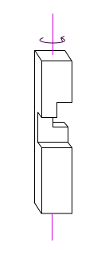
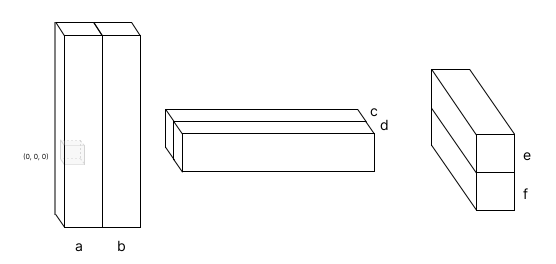

# Wood Puzzle Solver README

Our family has this wooden puzzle. It is made of 6 pieces. For the last three years, though we tried many times to find a solution, it has stayed apart.



That's what this is for!

`main.py` tries each possible arrangement of the pieces, testing for overlaps. If none of the pieces overlap, it prints the combination of rotations and translations that worked.

## How it works

When solved, this is what the puzzle looks like:


### Defining the pieces

In each block, we really only care about the middle section, made from 16 cubes that can either be present or missing. By defining a coordinate space, we can treat each cube as an (x, y, z) point. 



A piece is defined as a list of every present cube. For example, piece 4,



is saved in `pieces.py` as

```py
[ # 4
    {'x': 0, 'y': 0, 'z': 0},
    {'x': 0, 'y': 0, 'z': 3},
    {'x': 0, 'y': 1, 'z': 0},
    {'x': 1, 'y': 0, 'z': 0},
    {'x': 1, 'y': 0, 'z': 1},
    {'x': 1, 'y': 0, 'z': 2},
    {'x': 1, 'y': 0, 'z': 3},
    {'x': 1, 'y': 1, 'z': 0},
    {'x': 1, 'y': 1, 'z': 1},
],
```

Run `> python pieces.py` to view each piece.

### Defining the positions

Before attempting a solution, each piece can be rotated around its vertical principal axis in 90° increments. A piece rotated counter-clockwise 270° has `3` turns.



To rotate a piece `n` times, use `turnPieceNTimes(piece, n)`. This rotates every point in a piece around the vertical and returns the new piece.

Each position is assigned a letter. When assembled, the origin of the entire puzzle is the origin of the piece in position `a`.



To move a piece from position `a` (where it was defined) to another position, use `translations` from `translator.py`:

```py
from translator import translations
from rotator import rotatePieceNTimes
from pieces import pieces

piece = pieces[5]

# move piece 5 from a to c
movedPiece = translations['c'](piece)

# rotate piece 180°, then move it from a to f
movedAndRotatedPiece = translations['f'](rotatePieceNTimes(piece, 2))
```

### Trying each combination

`main.py` tries every combination of positions and rotations to find a solution. 

Each arrangement is made of a rotation array and a position array. For example, consider the arrangement of rotations `[2, 3, 1, 0, 1, 0]` and positions `['a', 'b', 'e', 'd', 'f', 'c']`.

```py
rotations = [
    2, # piece 0 should be 180°
    3, # 1 should be 270°
    1, # 2 should be 90°
    0, # 3 should be 0°
    1, # ...
    0
]

positions = [
    'a', # piece 0 should be in position a
    'b', # piece 1 should be in position b
    'e', # piece 2 should be in position e
    'd', # ...
    'f',
    'c'
]
```

Once all pieces are rotated and moved, the new array of pieces is checked for any overlaps. Two pieces overlap if they share any two points. This checking is done using `piecesOverlap(pieces)` from `overlapChecker.py`.